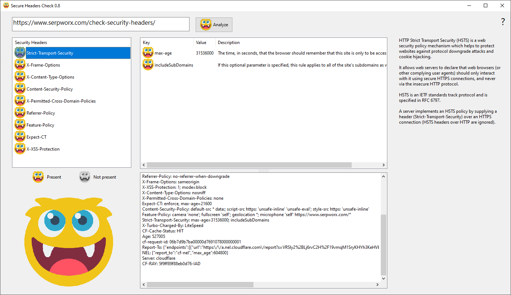

# Seurity Headers Scanner
Analyze security headers to see if you follow best practices

Inspired by https://owasp.org/www-project-secure-headers/

# About
Security Headers Check makes a GET request to the specified URL, analyzes the headers, and shows the results to you in an easy-to-understand way.

You also get the http code and all raw headers in the bottom field

Created with [Lazarus](https://www.lazarus-ide.org/)

# Plans
Check https://github.com/MFernstrom/SeurityHeaders/projects for details, but plans are to add options for POST requests with Form fields and File uploads.

# Test
During development I used `https://www.serpworx.com/check-security-headers/` to test, as they implement a number of headers.
